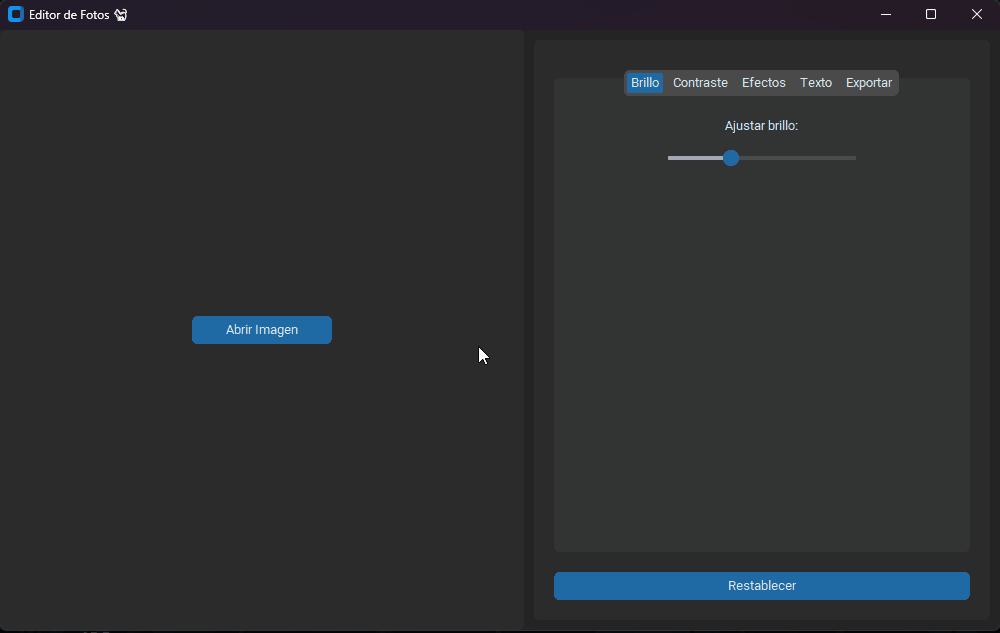

# Photo Editor

**Proyecto Final** para el curso *DevOps Foundations* del diplomado de Arquitectura y Seguridad Cloud en la Universidad de Santiago de Chile (USACH).

## Descripción

El proyecto **Photo Editor** es una aplicación que permite a los usuarios cargar y editar imágenes con diversos efectos y ajustes, como brillo, contraste, texto, y filtros de color. Este editor gráfico fue desarrollado principalmente con el fin de modularizar el código, mejorar la calidad y probar herramientas como SonarQube para la revisión de calidad de código, así como aplicar principios de buenas prácticas de DevOps.

## Funcionamiento
El siguiente GIF muestra el funcionamiento de Photo Editor:

### Objetivos del Proyecto:

1. **Calidad del código**: Validación y análisis continuo de la calidad mediante SonarQube.
2. **Modularización**: Separación lógica del código en diferentes módulos para mejorar la mantenibilidad y escalabilidad del proyecto.
3. **Pruebas**: Asegurar que las funciones del editor gráfico cumplen con las expectativas en términos de rendimiento y funcionalidad.
4. **DevOps**: Integración de herramientas de análisis estático como SonarQube y Jenkins para un pipeline de desarrollo eficiente.

## Características Principales

- **Carga de imágenes**: El usuario puede seleccionar una imagen desde su sistema local.
- **Ajustes de brillo y contraste**: Modificación interactiva de los niveles de brillo y contraste de la imagen.
- **Aplicación de efectos**: Filtros disponibles como blanco y negro, sepia, inversión de colores, desenfoque y realce de bordes.
- **Añadir texto**: Permite superponer texto personalizado a la imagen con opciones de color, posición y tamaño.
- **Exportación**: Guarda la imagen editada en formatos populares como PNG o JPEG.

## Estructura del Proyecto

La estructura del proyecto sigue una organización modular, dividida en archivos que agrupan la lógica por componentes:

- **main.py**: Contiene la interfaz principal de la aplicación utilizando `customtkinter`. Maneja la disposición de las pestañas, sliders y botones para interactuar con la imagen.
- **image_widgets.py**: Define las clases y funciones relacionadas con la importación de imágenes, ajustes visuales y manipulación básica de los elementos gráficos.
- **effects.py**: Contiene las funciones de procesamiento de imágenes, como la conversión a blanco y negro, la aplicación del efecto sepia, desenfoque, entre otros.
- **text_manager.py**: Maneja la superposición de texto en las imágenes, permitiendo ajustar características como el tamaño, color, posición y contorno del texto.
- **settings.py**: Archivo de configuración con valores por defecto para ajustes de rotación, brillo, contraste y efectos.
- **sonar-project.properties**: Archivo de configuración para el análisis del proyecto en SonarQube.
- **requirements.txt**: Lista de dependencias del proyecto, como `customtkinter` y `Pillow`.
- **.gitignore**: Archivo para excluir del repositorio ciertos archivos y directorios innecesarios.
